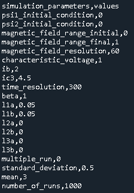
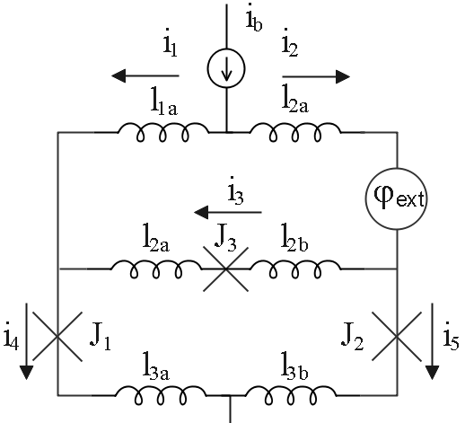

***********************
Input Text File Format
***********************

PySQIF has an input csv file for input protocol with the user,
this file is named as input.csv. 
Figure shows below input parameters of this simulation in input csv file,
which can be edited by the user.

   

"input.csv" file has two columns, "circuit_parameters" columns represents Bi-SQUID circuit elements,
and "values" columns represents mathematical value of these circuit elements.
Figure shows below Bi-SQUID circuit representation:

   
 
* psi1_initial_condition and psi2_initial condition are represent initial conditions of Bi-SQUID systems of differential equations. If you don't familiar with differential equations content, you can set these values as 0.
* magnetic_field_range_initial and magnetic_fieldt_range_final define range of the external applied normalized magnetic field.
* magnetic_field_resolution defines length of the external applied normalized magnetic field array
* characteristic_current represents characteristic voltage, Vn = IcRn.
* ib represents normalized bias current.
* ic3 represents normalized current of shunt junction's critical current.
* time_resoluition defines length of the time step array. Time step array represents time steps of Bi-SQUID systems of differential equations.
* beta controls size of upper loop.
* l1a, and l1b represents normalized inductances at top of the circuit.
* l2a, and l2b represents normalized inductances at parallel third Josephson Junction.
* l3a, and l3b repesents normalized inductances at bottom of circuit.
* multiple_run defines multiple run selection of this simulation. 0 means that single run, 1 means that multiple run. In the multiple run selection PySSQIF creates ic3 gaussian distribution according to mean and standard deviation inputs.
* standard_devaiation determines standard deviation of ic3 distribution in multiple run case.
* mean represents mean of the ic3 gaussian distribution in multiple run case.
* number_of_runs defines length of the ic3 gaussian distribution.
