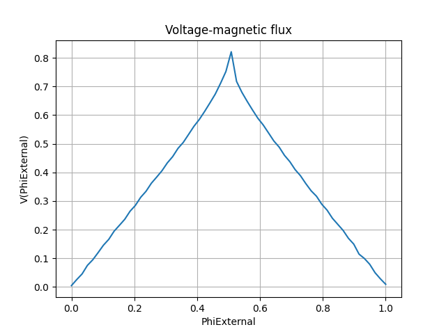

*******************************
Bi-SQUID Single Run Simulation
*******************************

Input Text File Preparation
==================

Firstly, we should prepare input text file for our simulation goals.
Input csv file content is shown in below for this tutorial. Input csv file
represents circuit and simulation parameters. Download link for this input csv file:
https://github.com/aakgn/PySQIF/blob/main/docs/tutorial_resources/bi-squid_single_run.csv

simulation_parameters,values
psi1_initial_condition,0
psi2_initial_condition,0
magnetic_field_range_initial,0
magnetic_field_range_final,1
magnetic_field_resolution,60
characteristic_voltage,1
ib,2
ic3,1
time_resolution,300
beta,1
l1a,0.27
l1b,0.27
l2a,0.24
l2b,0.24
l3a,0.3
l3b,0.3
multiple_run,0
standard_deviation,0.5
mean,3
number_of_runs,1000

Running Simulation
==================

Secondly, we should import and initialzie our PySQIF library.

``from PySQIF.Main import Main as pysqif``
``voltage_response = pysqif("bi-squid_single_run.csv")``

We imported and constructed our library. Finally, we can calculate
voltage response of our circuit by using calculate method.

``voltage_response = voltage_response.calculate("bi-squid_single_run.csv")``

When simulation time is done, two output file appears in the current working folder.
First of them is output_voltage.csv, this csv fiel consists voltage response of 
our circuit in defined normalized extetrnal magnetic flux range. Contents of this
output file is shown in below:

0.004692304256691296
0.025806626400257465
0.04541504641262365
0.07537364451486167
0.09473592404676143
0.1196659923965758
0.14558069961756528
         .
         .
         .
0.028365755049872078
0.009187858044251223

Second output file is output_normalized_magnetic_flux.csv, this file consists
normalized external magnetic flux array in defined range. Contents of this file
is shown in below:

0.0
0.01694915254237288
0.03389830508474576
0.05084745762711865
       .
       .
       .
0.9661016949152542
0.9830508474576272
1.0

Visualization
==================

Finally, we can visualize our results by using PySQIF Plot module. As we did before
firstly, we should import and construct our Plot module ,and then we can plot our results
by using the plot method.

``from PySQIF.Plot import Plot as plt``

``plot = plt(voltage_response)``

``plot.plot(voltage_response)``

Figure shows output visualization below:

